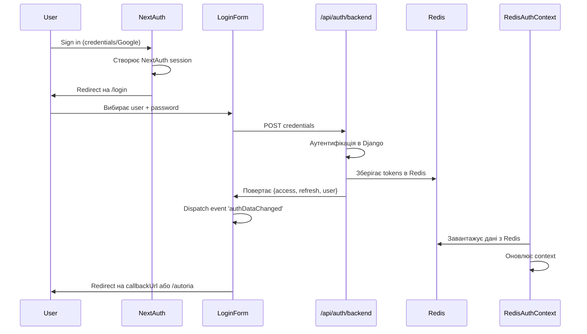
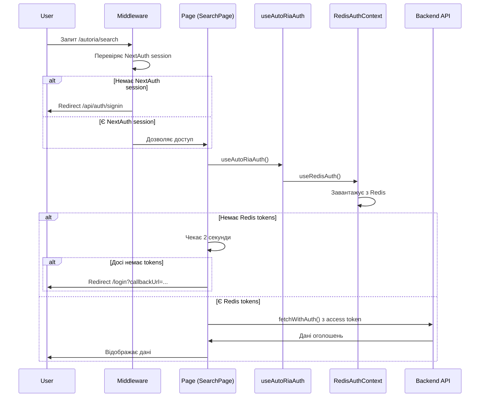
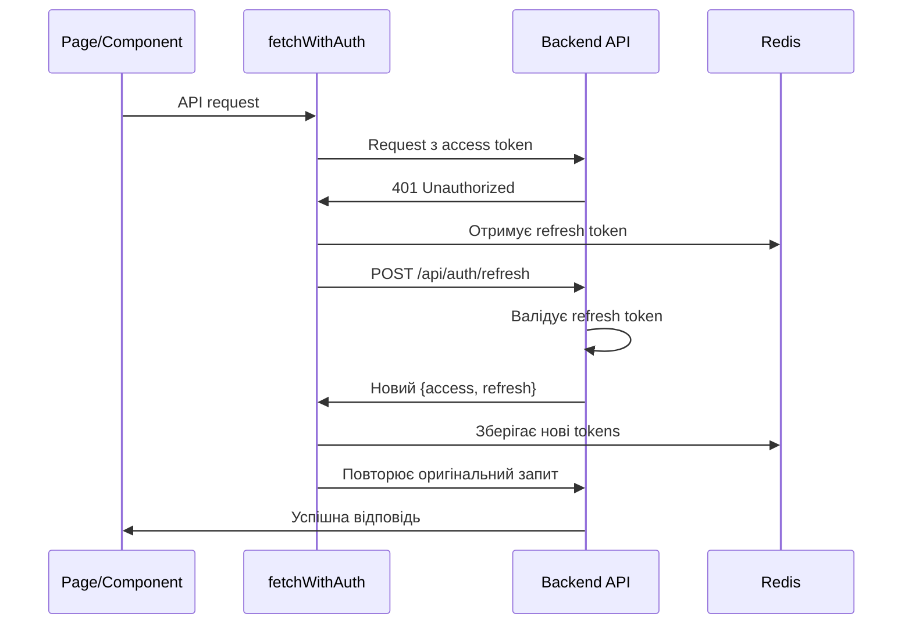

# 🔐 Система двохрівневої аутентифікації

## 📋 Зміст

- [Огляд системи](#огляд-системи)
- [Архітектура](#архітектура)
- [Рівні аутентифікації](#рівні-аутентифікації)
- [Місця зберігання даних](#місця-зберігання-даних)
- [Потік автор](#потік-авторизації)
- [Компоненти системи](#компоненти-системи)
- [Middleware та захист маршрутів](#middleware-та-захист-маршрутів)
- [Відображення статусу користувача](#відображення-статусу-користувача)
- [Обробка помилок та редіректи](#обробка-помилок-та-редіректи)

---

## Огляд системи

Проект використовує **двохрівневу систему аутентифікації**, яка забезпечує:
1. **Базову сесію** через NextAuth (перший рівень)
2. **Токени Backend API** збережені в Redis (другий рівень)

### Чому два рівні?

- **NextAuth** управляє сесією користувача на рівні Next.js
- **Backend токени** надають доступ до Django REST API
- **Обидва рівні необхідні** для повноцінної роботи з AutoRia функціоналом

---

## Архітектура

```
┌─────────────────────────────────────────────────────────────┐
│                    КОРИСТУВАЧ                                │
└──────────────────────┬──────────────────────────────────────┘
                       │
                       ▼
┌─────────────────────────────────────────────────────────────┐
│              РІВЕНЬ 1: NextAuth SESSION                      │
│  ┌──────────────────────────────────────────────────────┐   │
│  │  • JWT токен в HTTP-only cookie                      │   │
│  │  • Базова інформація про користувача (email)        │   │
│  │  • Управляється Next.js                             │   │
│  └──────────────────────────────────────────────────────┘   │
└──────────────────────┬──────────────────────────────────────┘
                       │
                       ▼
┌─────────────────────────────────────────────────────────────┐
│              РІВЕНЬ 2: Backend AUTH (Redis)                  │
│  ┌──────────────────────────────────────────────────────┐   │
│  │  • access token (JWT от Django)                      │   │
│  │  • refresh token (JWT от Django)                     │   │
│  │  • Повна інформація про користувача                  │   │
│  │  • Ролі: is_superuser, is_staff, is_premium         │   │
│  └──────────────────────────────────────────────────────┘   │
└──────────────────────┬──────────────────────────────────────┘
                       │
                       ▼
┌─────────────────────────────────────────────────────────────┐
│                  DJANGO REST API                             │
│  • Операції з оголошеннями                                  │
│  • Модерація контенту                                       │
│  • Управління профілем                                      │
│  • AI сервіси                                               │
└─────────────────────────────────────────────────────────────┘
```

---

## Рівні аутентифікації

### 🔹 Рівень 1: NextAuth Session

**Мета:** Управління сесією на рівні Next.js

**Що зберігається:**
- Email користувача
- Провайдер аутентифікації (Google, Credentials)
- Базові дані профілю

**Де зберігається:**
- HTTP-only cookie (`next-auth.session-token`)
- Server-side session через NextAuth

**Коли перевіряється:**
- `middleware.ts` перевіряє наявність NextAuth сесії
- Захищає маршрути `/login`, `/autoria/*`

### 🔹 Рівень 2: Backend Auth (Redis)

**Мета:** Доступ до Django REST API

**Що зберігається:**
```typescript
interface RedisAuthData {
  access: string;        // JWT access token від Django
  refresh: string;       // JWT refresh token від Django
  user: {
    id: number;
    email: string;
    username?: string;
    first_name?: string;
    last_name?: string;
    is_superuser: boolean;   // Повний доступ до системи
    is_staff: boolean;        // Доступ до модерації (читання)
    is_premium?: boolean;     // Преміум функції
  };
  provider: 'backend' | 'dummy';
  refreshAttempts?: number;
  lastRefreshTime?: number;
}
```

**Де зберігається:**
- Redis (ключ: `backend_auth` або `dummy_auth`)
- Context API: `RedisAuthContext`

**Коли перевіряється:**
- Кожен запит до API через `fetchWithAuth()`
- Компоненти через `useAutoRiaAuth()` хук
- `RedisUserBadge` для відображення статусу

---

## Місця зберігання даних

### ❌ НЕ використовуємо localStorage

**Раніше:** Токени зберігались в `localStorage`  
**Зараз:** Використовуємо **Context API + Redis**

### ✅ Актуальна схема зберігання

| Дані | Де зберігається | Доступ |
|------|----------------|--------|
| **NextAuth session** | HTTP-only cookie | Server + Client (через `useSession()`) |
| **Backend tokens** | Redis (`backend_auth`) | Client через API `/api/redis` |
| **Поточний provider** | Context API (`AuthProviderContext`) | Client (`useAuthProvider()`) |
| **User info від Redis** | Context API (`RedisAuthContext`) | Client (`useRedisAuth()`) |
| **Combined auth state** | `useAutoRiaAuth()` hook | Компоненти |

---

## Потік авторизації

### 1️⃣ Початковий вхід (Sign In)



### 2️⃣ Доступ до захищеної сторінки



### 3️⃣ Оновлення токенів (Refresh)



---

## Компоненти системи

### 🔧 Core Contexts

#### 1. **AuthProviderContext**
```typescript
// frontend/src/contexts/AuthProviderContext.tsx
{
  provider: 'backend' | 'dummy',
  setProvider: (provider) => void
}
```
**Відповідає за:** Перемикання між backend та dummy провайдерами

#### 2. **RedisAuthContext**
```typescript
// frontend/src/contexts/RedisAuthContext.tsx
{
  redisAuth: RedisAuthData | null,
  isLoading: boolean,
  refreshRedisAuth: () => Promise<void>
}
```
**Відповідає за:** 
- Завантаження даних з Redis
- Оновлення при зміні provider
- Реакція на події `authDataChanged`

#### 3. **AuthContext**
```typescript
// frontend/src/contexts/AuthContext.tsx
{
  user: User | null,
  accessToken: string | null,
  refreshToken: string | null,
  login: (user, access, refresh) => void,
  logout: () => void
}
```
**Відповідає за:** Загальний стан аутентифікації

### 🎣 Hooks

#### useAutoRiaAuth
```typescript
// frontend/src/hooks/autoria/useAutoRiaAuth.ts
const {
  isAuthenticated: boolean,
  isLoading: boolean,
  token: string | null,
  user: User | null,
  getToken: () => Promise<string | null>,
  refreshToken: () => Promise<string | null>,
  checkAuth: () => Promise<boolean>
} = useAutoRiaAuth();
```

**Комбінує:**
- NextAuth session (`useSession()`)
- Redis auth data (`useRedisAuth()`)
- Provider info (`useAuthProvider()`)

**Використовується в:**
- SearchPage
- ModerationPage
- Всіх AutoRia компонентах

---

## Middleware та захист маршрутів

### frontend/src/middleware.ts

```typescript
// Публічні маршрути (без аутентифікації)
const PUBLIC_PATHS = [
  '/api/auth',
  '/api/redis',
  '/api/public',
  '/register'
];

// Потрібна тільки NextAuth session
const INTERNAL_AUTH_PATHS = [
  '/login',
  '/profile',
  '/settings'
];

// Потрібні ОБА: NextAuth + Redis tokens
const AUTORIA_PATHS = [
  '/autoria/search',
  '/autoria/my-ads',
  '/autoria/favorites',
  '/autoria/create'
];
```

### Логіка перевірки

1. **Статичні файли** → дозволити
2. **PUBLIC_PATHS** → дозволити
3. **INTERNAL_AUTH_PATHS** → перевірити NextAuth
4. **AUTORIA_PATHS** → перевірити NextAuth (Redis перевіряє компонент)

**Чому не перевіряємо Redis в middleware?**
- Middleware не має прямого доступу до Redis
- Компоненти самі перевіряють Redis токени
- Middleware тільки забезпечує базову NextAuth сесію

---

## Відображення статусу користувача

### Два бейджа в Header

#### 1. **Session Badge** (NextAuth)
```tsx
// Відображає email з NextAuth session
<Badge>
  {session?.user?.email}
</Badge>
```

#### 2. **RedisUserBadge** (Backend Auth)
```tsx
// frontend/src/components/All/RedisUserBadge/RedisUserBadge.tsx
<RedisUserBadge />

// Показує:
// • Email/Username з Redis
// • Роль (Superuser/Staff/User)
// • Статус токенів (✓ Active / ✗ Missing)
// • Provider (Backend/Dummy)
```

### Приклад відображення

```
┌─────────────────────────────────────────────┐
│ Header                                      │
├─────────────────────────────────────────────┤
│  [NextAuth] pvs.versia@gmail.com           │
│  [Redis] 👑 SUPERUSER • ✓ Tokens Active    │
└─────────────────────────────────────────────┘
```

---

## Обробка помилок та редіректи

### Сценарій 1: Немає NextAuth session

```
User → /autoria/search
  ↓
Middleware перехоплює
  ↓
Redirect → /api/auth/signin?callbackUrl=/autoria/search
```

### Сценарій 2: Є NextAuth, але немає Redis tokens

```
User → /autoria/search
  ↓
Middleware: ✅ NextAuth OK → дозволяє
  ↓
SearchPage: useAutoRiaAuth()
  ↓
  isAuthenticated = false (немає Redis)
  ↓
Чекає 2 секунди
  ↓
Якщо досі немає → Redirect → /login?callbackUrl=/autoria/search
```

### Сценарій 3: 401 від API

```
Component → API request
  ↓
fetchWithAuth() отримує 401
  ↓
Намагається refresh token
  ↓
  ✅ Success → повторює запит
  ❌ Fail → Redirect /login
```

### Сценарій 4: Успішний логін

```
LoginForm → Submit credentials
  ↓
Backend authentication
  ↓
Зберігає в Redis
  ↓
Dispatch 'authDataChanged' event
  ↓
RedisAuthContext оновлюється
  ↓
Redirect на callbackUrl (якщо є) або /autoria
```

---

## Доступ до модерації

### Правила доступу

| Роль | is_staff | is_superuser | Доступ |
|------|----------|--------------|--------|
| **User** | ❌ | ❌ | Немає доступу |
| **Moderator** | ✅ | ❌ | Тільки перегляд |
| **Superuser** | ✅ | ✅ | Перегляд + Операції |

### Перевірка в ModerationPage

```typescript
const isSuperUser = redisAuth?.user?.is_superuser || false;
const isModerator = redisAuth?.user?.is_staff || false;
const hasAccess = isSuperUser || isModerator;

if (!hasAccess) {
  // Redirect на головну
  window.location.href = '/';
}
```

---

## API Endpoints

### NextAuth

- `POST /api/auth/signin` - Вхід (NextAuth)
- `POST /api/auth/signout` - Вихід (NextAuth)
- `GET /api/auth/session` - Отримати session

### Backend Auth

- `POST /api/auth/backend` - Backend аутентифікація
- `POST /api/auth/refresh` - Оновити токени
- `GET /api/redis?key=backend_auth` - Отримати з Redis
- `POST /api/redis` - Зберегти в Redis
- `DELETE /api/redis?key=backend_auth` - Видалити з Redis

---

## Troubleshooting

### Проблема: "Дані не завантажуються на SearchPage"

**Причина:** Немає Redis tokens або повільне завантаження

**Рішення:**
1. Перевірити console logs: `[SearchPage]`, `[RedisAuthContext]`
2. Перевірити Redis: `GET /api/redis?key=backend_auth`
3. Залогінитись заново через `/login`

### Проблема: "Постійні редіректи між /login та /autoria/search"

**Причина:** Токени не зберігаються в Redis або не завантажуються

**Рішення:**
1. Перевірити `fetchAuth` response: `redisSaveSuccess: true`
2. Перевірити event dispatch: `authDataChanged`
3. Очистити Redis: `DELETE /api/redis?key=backend_auth`

### Проблема: "401 помилки від API"

**Причина:** Токен expired або невалідний

**Рішення:**
1. `fetchWithAuth()` автоматично спробує refresh
2. Якщо refresh fails → redirect на `/login`
3. Перевірити логи: `[TokenRefresh]`

---

## Best Practices

### ✅ DO

- Завжди використовувати `useAutoRiaAuth()` в AutoRia компонентах
- Використовувати `fetchWithAuth()` для API запитів
- Перевіряти `isLoading` перед використанням `user` data
- Відправляти `authDataChanged` event після зміни токенів
- Давати час (2 сек) на завантаження Redis після NextAuth

### ❌ DON'T

- НЕ зберігати токени в localStorage
- НЕ робити прямі запити до API без `fetchWithAuth()`
- НЕ забувати про перевірку `authLoading` стану
- НЕ редіректити одразу при `!isAuthenticated`
- НЕ перевіряти Redis в middleware

---

## Діаграма повного життєвого циклу

```
┌──────────────────────┐
│   Initial Load       │
└──────────┬───────────┘
           │
           ▼
┌──────────────────────┐
│  Check NextAuth      │
│  Session             │
└──────────┬───────────┘
           │
    ┌──────┴──────┐
    │             │
    ▼             ▼
  ❌ No        ✅ Yes
    │             │
    │             ▼
    │      ┌──────────────┐
    │      │ Load Redis   │
    │      │ Auth Data    │
    │      └──────┬───────┘
    │             │
    │      ┌──────┴──────┐
    │      │             │
    │      ▼             ▼
    │    ❌ No        ✅ Yes
    │      │             │
    │      │             ▼
    │      │      ┌────────────┐
    │      │      │ Render App │
    │      │      │ (Authed)   │
    │      │      └────────────┘
    │      │
    │      ▼
    │   Wait 2s
    │      │
    │      ▼
    │   Still No?
    │      │
    ▼      ▼
 ┌──────────────────┐
 │ Redirect /login  │
 │ ?callbackUrl=... │
 └──────────────────┘
```

---

## Changelog

| Дата | Зміни |
|------|-------|
| 2024-10-25 | ✅ Створено документацію |
| 2024-10-25 | ✅ Переведено на використання Context API замість localStorage |
| 2024-10-25 | ✅ Додано логіку затримки для завантаження Redis |
| 2024-10-25 | ✅ Виправлено передачу callbackUrl |
| 2024-10-25 | ✅ Додано фільтр status='active' за замовчуванням |

---

**Підтримка:** Якщо виникають проблеми, перевірте логи в консолі браузера з префіксами:
- `[RedisAuthContext]`
- `[useAutoRiaAuth]`
- `[SearchPage]`
- `[LoginForm]`
- `[Middleware]`

